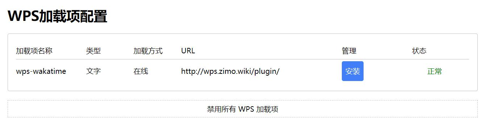
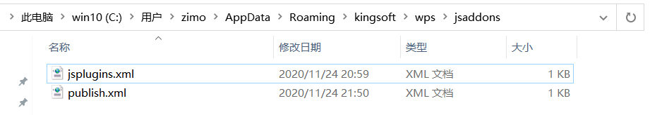
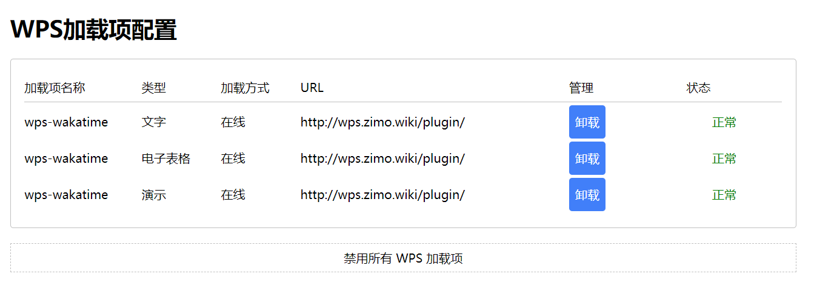

# wps-wakatime

开发文档参考：https://open.wps.cn/docs/office

开发文档参考：https://wakatime.com/help/creating-plugin#getting-started

# What's this?

为wps写的wakatime插件

# How to use this?

1. 访问http://wps.zimo.wiki/publish.html
    
2. 点击安装，安装`wps-wakatime`加载项
3. 打开cmd，输入`echo %APPDATA%`，拿到输出结果，大概是类似这样的`C:\Users\zimo\AppData\Roaming`
4. 打开文件管理器，进入上面的目录下，然后再继续进入`\kingsoft\wps\jsaddons`
    
5. 用文本编辑器修改`publish.xml`的内容，为下面这样
    ```xml
    <?xml version="1.0" encoding="UTF-8"?>
    <jsplugins>
        <jspluginonline enable="true" url="http://wps.zimo.wiki/plugin/" type="wps" name="wps-wakatime"/>
        <jspluginonline enable="true" url="http://wps.zimo.wiki/plugin/" type="et" name="wps-wakatime"/>
        <jspluginonline enable="true" url="http://wps.zimo.wiki/plugin/" type="wpp" name="wps-wakatime"/>
    </jsplugins>
    ``` 
6. 保存
7. 刷新第一步中的网页，看到下面这样全部正常，加载项就安装ok了
    
8. 最后，像以前一样使用`wps`即可，第一次打开时可能需要先配置api_key，请去`wakatime`官网获取

# 更新日志

- 2020-11-25 修复一些bug，主要是加入一些兼容性代码 v1.0.1
- 2020-11-24 发布 v1.0.0

# 说明

1. 此项目为`纯前端`项目
2. 更多说明请看`wps`和`wakatime`官方文档
3. 如有任何bug，请提`issue`